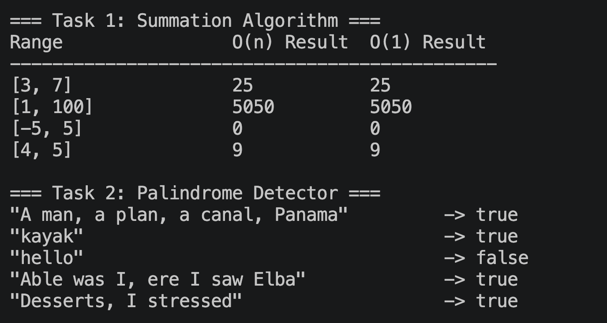

# Assignment 1: Algorithm Design and Analysis

**Name:** Vincent Goldberg  
**Course:** C343 Data Structures  
**Date:** May 22, 2026

## Complexity Analysis

### Task 1 — Summation Algorithm

**sumLinear — O(n)**  
This method uses a for loop that runs once for each integer in the range from n1 to n2. If the range has 100 numbers, it loops 100 times. If it has 1,000, it loops 1,000 times. The time it takes grows linearly with the size of the range, so the complexity is O(n) where n is the number of integers between n1 and n2.

**sumConstant — O(1)**  
This method uses the arithmetic series formula: `count * (n1 + n2) / 2`. The idea comes from pairing numbers at opposite ends of the range — each pair always adds up to the same value (n1 + n2), and there are count/2 such pairs. Because the result is computed directly from those three values with no looping, it runs in constant time regardless of how large the range is. Therefore, the complexity is O(1).

### Task 2 — Palindrome Detector

**isPalindrome — O(n)**  
This is the public entry point for the palindrome check. It first cleans the input string using `replaceAll`, which scans every character once, and then converts it to lowercase–both O(n) operations. It then passes the cleaned string to the recursive helper. Overall, the complexity of this method is O(n) where n is the length of the original string.

**isPalindromeHelper — O(n)**  
The helper uses two pointers starting at opposite ends of the cleaned string and moves them inward one step each recursive call. It makes at most n/2 recursive calls before the pointers meet in the middle. However, since constants are dropped, it runs in O(n) time where n is the length of the cleaned string. Overall the method is O(n).

## Output Screenshot

