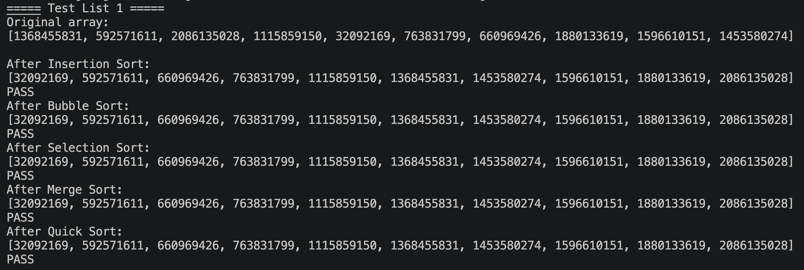
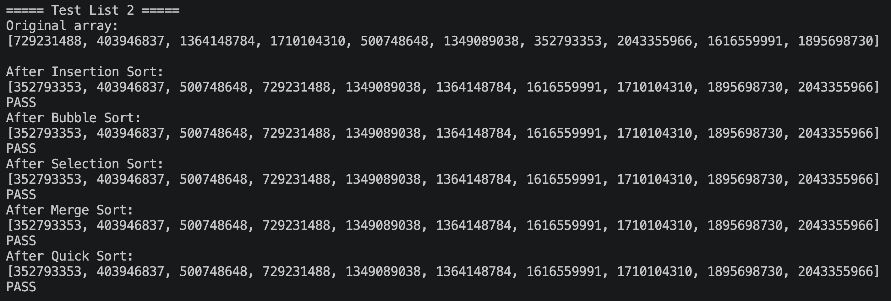
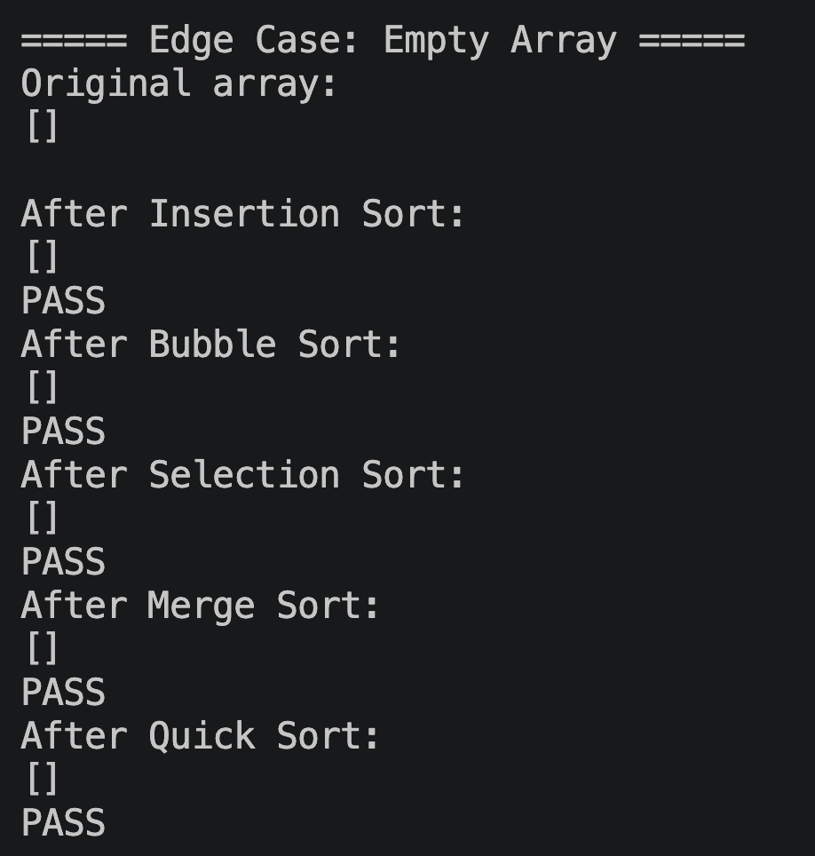
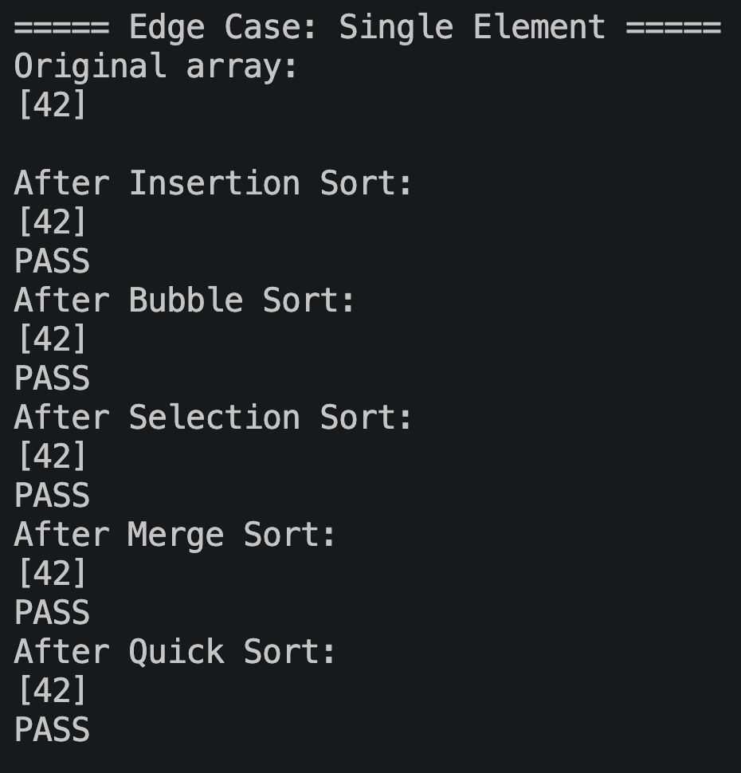
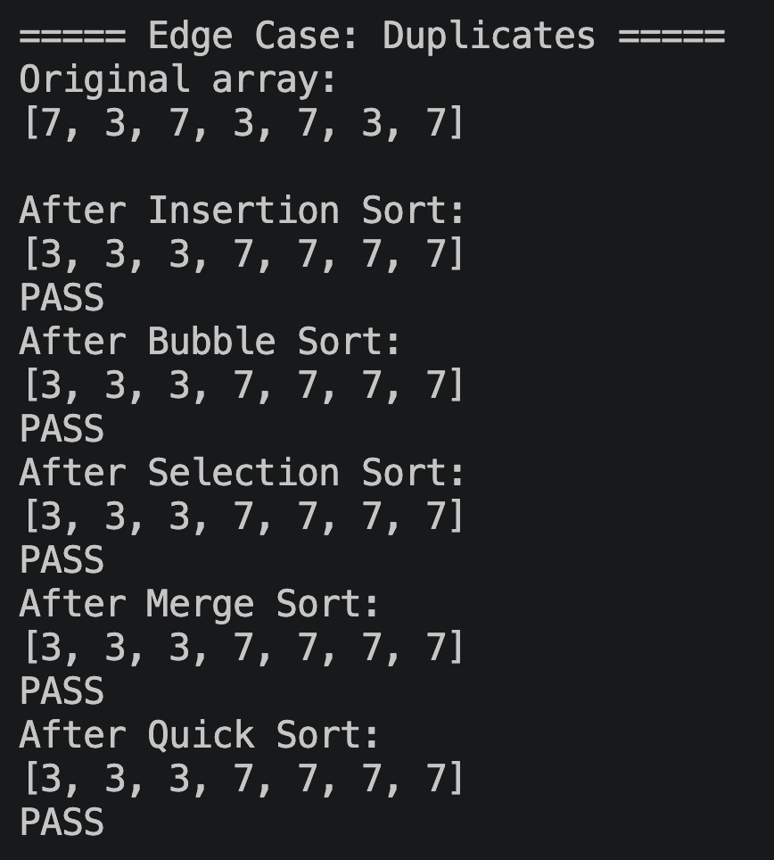
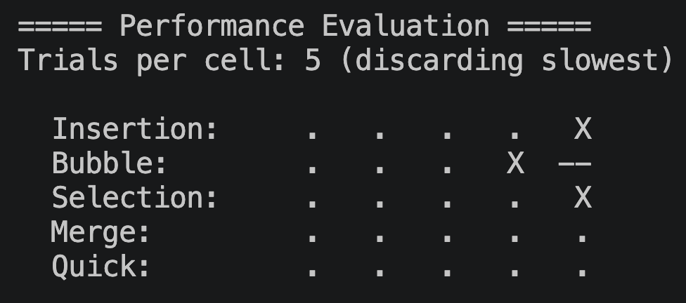
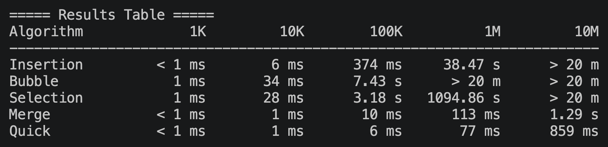
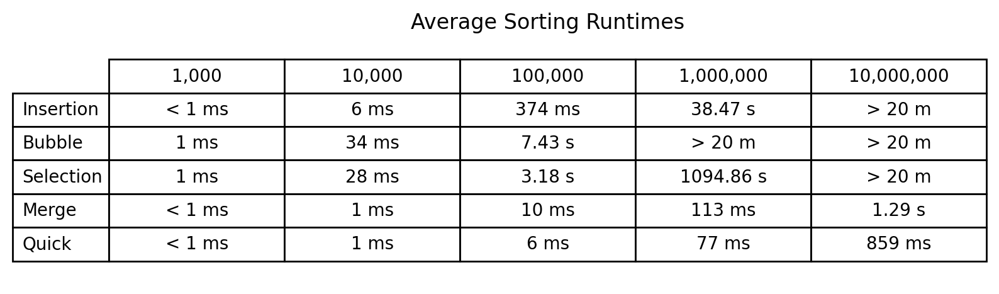
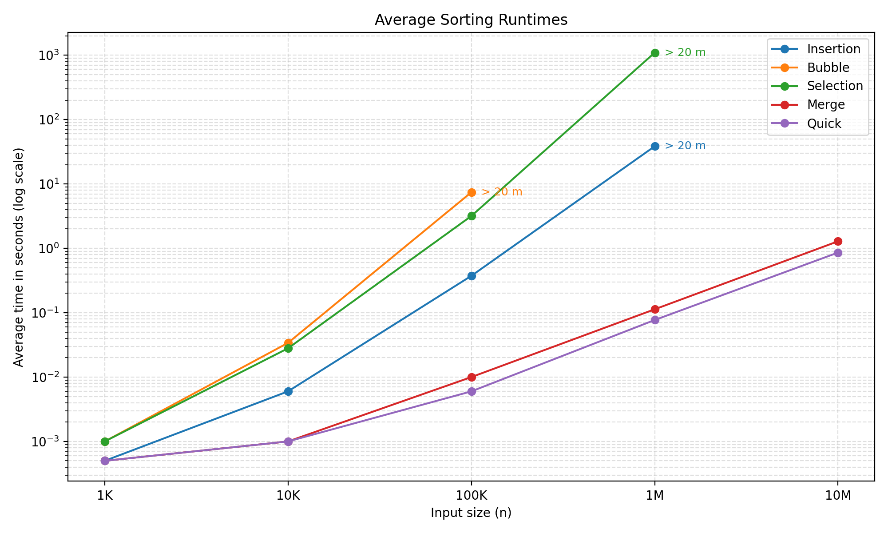

# M3 Project 1: Sorting Algorithms - Performance Analysis Report

**Name:** Vincent Goldberg

**Course:** C343 Data Structures

**Date:** June 12, 2026

## Testing Results (Task 2)

All five algorithms were tested on two random 10-element lists. Each
screenshot shows the original unsorted list followed by the output of each
algorithm, with a PASS/FAIL check that verifies the result is in ascending
order.

Edge cases were also tested: an empty array, a single-element array, and an
array with duplicate values.

## Test Setup

Each algorithm was timed on randomly generated int arrays (values up to
Integer.MAX_VALUE) at five sizes: 1,000 / 10,000 / 100,000 / 1,000,000 /
10,000,000. Every algorithm/size combination was run 5 times, the slowest
run was discarded as an outlier, and the remaining 4 runs were averaged.
Only the sort itself was timed (data generation excluded). Any run that
went past 20 minutes was cut off and recorded as "> 20 m". Once an
algorithm timed out at one size, the larger sizes were skipped and also
recorded as "> 20 m", since these algorithms only get slower as n grows.

During the evaluation, console output was used to show live progress with each
dot representing a completed sort, an X representing a timeout, and -- indicating a skipped dataset. The results were printed as a table to the console as a sanity check. 

## Results Table

The average times of the evaluations were saved to a `performance_results.csv`. This CSV was utilized in a Python script to create visuals that represented the results of the sorting algorithms. 

## Chart

Both axes use a log scale so the fast and slow algorithms fit on one chart.
Some lines end where the algorithm exceeded the 20 minute limit at the next
size. Times that measured under 1 ms are plotted at 0.5 ms since a log
scale can't show 0.

## Observations and Conclusions

The results split the five algorithms into two clear groups: the $O(n^2)$
sorts (insertion, bubble, selection) and the $O(n log n)$ sorts (merge,
quick). On the log chart this shows up as two different slopes. Every
time n grows 10x, the quadratic sorts take roughly 100x longer (insertion
went from 374 ms at 100K to 38.47 s at 1M, about a 103x jump), while merge
and quick only take around 10x longer. That difference is what makes the
quadratic group fall off a cliff; bubble sort couldn't finish 1,000,000
numbers inside 20 minutes, and selection sort just barely made it at approximately 18.2
minutes. Meanwhile quick sort handled 10,000,000 numbers in under a second.

Below about 10,000 elements, the algorithm choice was less important. All
five finished in 34 ms or less, so for small inputs a simple sort is
perfectly fine. But as the dataset size increases, algorithm selection becomes important. Therefore, for any dataset that could grow large, an $O(n log n)$
sort is the only reasonable option, because the quadratic sorts go from
"fine" to "won't finish today" within two orders of magnitude. Quick sort
is the best general-purpose pick here, and should be the algorithm of choice for large datasets. Merge sort is worth the small extra cost when you
need a stable sort or a guaranteed $O(n log n)$ worst case. Insertion sort still has a niche for very small or nearly-sorted inputs. Bubble sort and selection sort seem to mostly serve as
teaching examples; nothing in these results gives a reason to use either
in practice.
