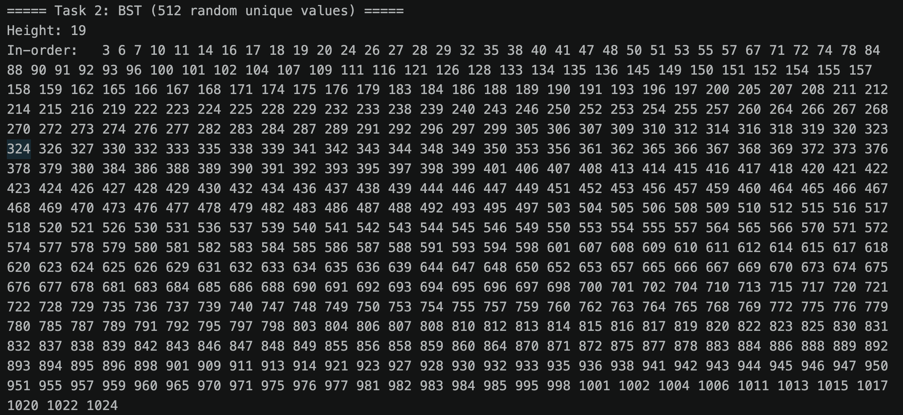

# M4 Project 2: BST and AVL

**Name:** Vincent Goldberg

**Course:** C343 Data Structures

**Date:** June 21, 2026

## Overview

This project implements two tree data structures and compares their behavior:

- A **Binary Search Tree (BST)** with `insert`, `delete`, `search`, the three
  traversals (in-order, pre-order, post-order), and `height`.
- A self-balancing **AVL Tree** that extends the BST and adds rotation-based
  rebalancing (left, right, left-right, right-left) to keep its height
  logarithmic after every insert and delete.

All operations are written recursively. Each public method delegates to a
private helper that takes and returns a `Node`, which lets `AVLTree` override
`insert`/`delete` and rebalance on the way back up the recursion.

The program (`Main.java`) runs Tasks 2, 4, and 5 in order and prints labeled
results. Because the full traversal output is very large (512 values printed
three times per tree), the complete console output is captured in
[`output.txt`](output.txt) and included as an appendix. The screenshots below
show the relevant sections.

## Part 1 — BST (Tasks 1 & 2)

A `BinarySearchTree` was built by inserting 512 unique random values in the
range [1, 1024]. The program prints the tree height followed by all three
traversals, each clearly labeled.

The in-order traversal prints the values in ascending sorted order, which
confirms the tree is structured correctly.

<!--  -->

## Part 2 — AVL (Tasks 3 & 4)

The **same** 512 values from Task 2 were inserted into an `AVLTree`. The program
again prints the height and all three traversals. The in-order traversal matches
the BST's in-order output exactly (same sorted sequence), confirming both trees
contain the identical data — but the AVL's height is noticeably smaller because
it rebalances itself.

## Part 3 — Comparative Testing & Discussion (Task 5)

### Test datasets

Three datasets of 512 values each were inserted into both a BST and an AVL Tree,
and the resulting heights were compared:

1. **Sorted ascending** (1, 2, 3, … 512)
2. **Sorted descending** (512, 511, … 1)
3. **Random unique** values drawn from [1, 1024]

### Results

<!-- SCREENSHOT: Task 5 height comparison table from console -->

*(BST height for the random case varies per run since the data is randomized;
the AVL height stays at roughly 10–11 regardless.)*

### Analysis

The experiment shows the difference between the two structures. A
plain BST's shape — and therefore its performance — depends entirely on the
order in which values are inserted, while an AVL Tree guarantees a balanced
shape regardless of insertion order.

Sorted input is the BST's worst case. When values arrive in ascending or
descending order, every new value is larger (or smaller) than everything
already in the tree, so each insert travels down the same side. The tree never
branches and degenerates into a straight line — essentially a linked list — of
height equal to the number of nodes (512). In this shape, `search`, `insert`,
and `delete` all degrade to $O(n)$, because reaching the bottom means visiting
every node.

The AVL Tree avoids this entirely. For the exact same sorted input, the AVL
detects imbalance after each insert (a balance factor of +2 or −2) and performs
rotations to restore balance. The result is a height of about 10 — roughly
$log₂(512) ≈ 9$ — instead of 512. Its operations stay $O(log n)$ no matter how
the data is ordered.

On random data the gap is smaller but still real. A randomly built BST is
usually reasonably distributed (height ≈ 19 here), but it is still noticeably taller
than the AVL (≈ 11) and offers no guarantee. Therefore, a particularly unlucky ordering
could still produce a tall tree.

The AVL pays for its guarantee with extra work on every insert
and delete; it tracks each node's height and may perform rotations. A plain BST
has simpler, slightly faster individual operations. Ultimately, a BST is best
when the input is known to be random and balance is not critical. But when input
order is unpredictable — or could be sorted — the AVL Tree is the safer choice
because it guarantees logarithmic height and therefore predictable performance.

## Appendix

The complete, unabridged console output (all heights and full traversals for
every task) is in [`output.txt`](output.txt).
