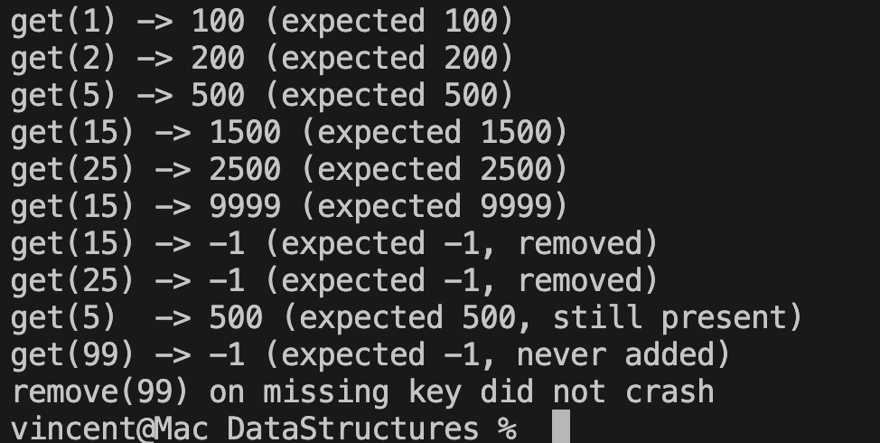

# M5 Assignment 3: Hash Table Implementation

**Name:** Vincent Goldberg

**Course:** C343 Data Structures

**Date:** June 19, 2026

## Overview

This project implements a hash table that maps `int` keys to `int` values and
handles collisions by chaining. The table is backed by a fixed array of 10
buckets; each bucket holds the head of a linked list of `Node` objects whose
keys hash to that index.

- `Node` — one key/value entry plus a `next` reference, forming the chain.
- `HashTable` — the bucket array, a `hash` method (`Math.abs(key) % SIZE`),
  and the three operations:
  - `put(key, value)` — updates the value if the key exists, otherwise inserts
    a new node at the head of the bucket's chain.
  - `get(key)` — walks the chain and returns the value, or `-1` if absent.
  - `remove(key)` — unlinks the matching node, re-routing the chain around it.
- `Main` — a test driver exercising every operation and edge case.

## Testing

`Main.java` runs the following scenarios and prints each result next to its
expected value:

- Basic insertion and retrieval (keys 1 and 2).
- Collision handling: keys 5, 15, and 25 all hash to index 5 and share one
  chain; each is inserted and retrieved correctly.
- Updating an existing key (15) replaces its value instead of adding a duplicate.
- Removing a middle node (15) and the head node (25) of the collision chain,
  leaving the remaining entry (5) intact.
- Edge cases: `get` on a missing key returns `-1`, and `remove` on a missing key
  is a safe no-op (no crash).

## Results (Screenshot)

<!-- SCREENSHOT: terminal output of `mvn -q compile exec:java` -->

